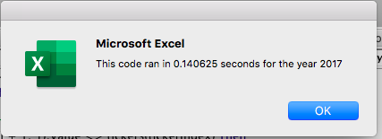
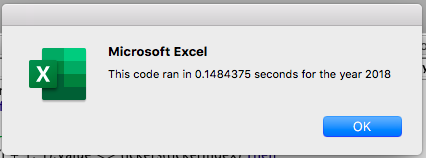

# VBA of Wall Street

## Overview of Project

### Purpose
The purpose of this project was to refactor the Module 2 code to determine whether refactoring the original code made the VBA script run faster, which is useful for analyzing thousands of stocks rather than a dozen stocks. By taking the module code we created for Steve initially, we can loop through the data one time and collect all the information more efficiently from refactoring. Refactoring can result in a faster run time by taking fewer steps, using less memory, or improving the logic of the code to make it easier for future users to read. 

## Results

### Stock Performance between 2017 and 2018 Comparison
When comparing the stock performance between 2017 and 2018 for the 12 tickers selected, the return results differed immensely. 

The 2017 stock performance turned out with nearly all positive stock prices compared to the beginning of the year, with a few even exceeding a 100% increase over the year. Ticker TERP was the only one of the 12 stocks with a negative return of 7.2%, which was not a large difference. 

Conversely, for the 2018 stock performance, only two companies' stocks, ENPH and RUN, returned positive stock prices at the end of year while the other 10 ended with a lower stock price than at the beginning of the year. This was visually easy to identify due to the conditional formatting in place indicating a negative or positive return for that column. 

### Analysis of Execution Times of Original Script and Refactored Script
Surprisingly, the original AllStockAnalysis macro we created during the module for both years, 2017 and 2018, were still run fairly quickly at 0.7265625 seconds and 0.71875 seconds, respectively.

However, refactoring this macro resulted in an exponentially quicker run time of 0.140625 seconds for 2017 data and 0.1484375 seconds for 2018 data. While they both produce the same results, it is optimal to refactor code, if possible, to increase efficiency.

## Summary

**What are the advantages or disadvantages of refactoring code?**

Advantages
1. Refactoring will execute a task much quicker.
2. The user is able to run the code with using less memory.
3. Refactoring lends fewer steps in the process.
4. The logic can be improved from refactoring.

Disadvantages
1. It is possible that the user may run into debugging issues if refactoring makes the code more complex
2. Can take longer to construct a refactored code.

**How do these pros and cons apply to refactoring the original VBA script?**

I definitely experienced a mix of the pros and cons listed above during this project. As expected, refactoring created efficiency by lessening the time it took to run both years' analyses. In addition, I also experienced multiple rounds of debugging as the code became more complex.
